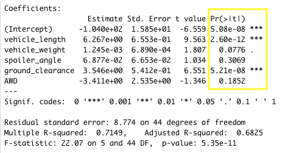

# MechaCar_Statistical_Analysis
Using R to run a statistical analysis on the car manufacturer, MechaCar, and it's production output to determine if production levels are on par with company standards.

 

## Linear Regression to Predict MPG
__Which variables/coefficients provided a non-random amount of variance to the mpg values in the dataset?__  
According to our linear regression, the p-values for vehicle length and ground clearance were statistically insignificant and therefore provided a non-random amount of variance to the MPG values in the dataset. 

  

 

__Is the slope of the linear model considered to be zero? Why or why not?__  
The slope of the linear model is not considered to be zero. This can be seen in the lm function, where it provides the slope coefficients for each variable. Given that none of the coefficients are zero, the slope of the model will not be zero.

  
 

__Does this linear model predict mpg of MechaCar prototypes effectively? Why or why not?__  
It is fair to say that this linear model does in fact predict mpg of MechaCar prototypes effectiely. While our r-squared value is 0.71, since we are evaluating multiple variables, we need to use our adjusted r-squared value, which is 0.68. In other words, our variables are 68% accurate in predicting miles per gallon. However it is important to note that only two of the five variables provided a non-random amount of variance to the mpg values in the dataset. Therefore, it would be wise to re-run this linear regression with our two statistically insignificant variables. 

  

 

## Summary Statistics on Suspension Coils
__Does the current manufacturing data meet the design specification for all manufacturing lots in total and each lot individually? Why or why not?__
When we look at a summary of all the manufacturing lots, we can see that the measured variance across all the lots is ~62.29 pounds per square inch. With this it seems as if MechaCar's specifications are indeed met. However, when we group our summary by lot numbers, we see a different story.

  
   

From our summary by lot, we see that two of the lots are well below MechaCar's design specification requirements. But with a variance of ~170.28 pounds per square inch, Lot 3 is well over the required varian limit and therefore does not meet the design specifications.

## T-Tests on Suspension Coils
#### Null Hypothesis: The PSI across all manufacturing lots is statistically equal to the population mean of 1,500 pounds per square inch.
#### Alternate Hypothesis: The PSI across all manufacturing lots is statistically different from the population mean of 1,500 pounds per square inch.

After running a one sample t-test on all the manufacturing lots, we are given a p-value of 2.2 x 10-16. Given that our critical value is 0.05, and that our p-value is significantly lower than this critical value, we can reasonably reject the null hypothesis that the true mean across all of the lots is statistically __equal__ the population mean of 1,500 pounds per square inch. Next, I ran a t-test for each individual lot (Lot1, Lot2, and Lot3). In all three of these tests, the results were similar, in that the p-value was significantly less than the critical value. From this, we can also infer that we should reject our null hypothesis and conclude that the PSI for __each__ manufacturing lot is statistically different from the population mean of 1,500 pounds per square inch.

  
   
  
  

## Study Design: MechaCar vs Competition
To ensure that MechaCar is producing a vehicle that outdoes its competition, it would be prudent to do a statistical study to compare performance of the MechaCar vehicles against performance of vehicles from other manufacturers. 

### What metric or metrics are you going to test?
For our study, we will need to analyze five key metrics in order to accurately determine that MechaCar is outperforming other manufacturers. These metrics include:
- Highwy milies per gallon (MPG)
- City miles per gallon (MPG)
- Safety ratings
- $CO_2$ emissions
- Purchase price

### What is the null hypothesis or alternative hypothesis?
For city MPG, highway MPG, and Safety Ratings, the null and alternative hypothesis will be as such:
 
-Null ($H_0$): MechaCar's mean is greater than it's competitors.  
-Alternative ($H_a$):MechaCar's mean is __not__ greater than it's competitors.
 

For $CO_2$ emissions and Cost, the null and alternative hypothesis will be as such:
 
-Null ($H_0$): MechaCar's mean is less than it's competitors.  
-Alternative ($H_a$):MechaCar's mean is __not__ less than it's competitors.
 

### What statistical tests would you use to test the hypothesis? And why?
To perform this study, will have to have two groups to compare - MechaCar and the market average. Since the success metrics will be numerical and the sample sizes will be large, a two-sample t-test should be used to compare the distribution of both groups. We will have to run a two-sample t-test for each metric and look at a summary of the test outcomes as a whole.

### What data is needed to run the statistical tests?
We will need two datasets to run the statistical tests. One dataset will contain MechaCar's metrics and the other dataset will comprise of market averages for these same metrics.

